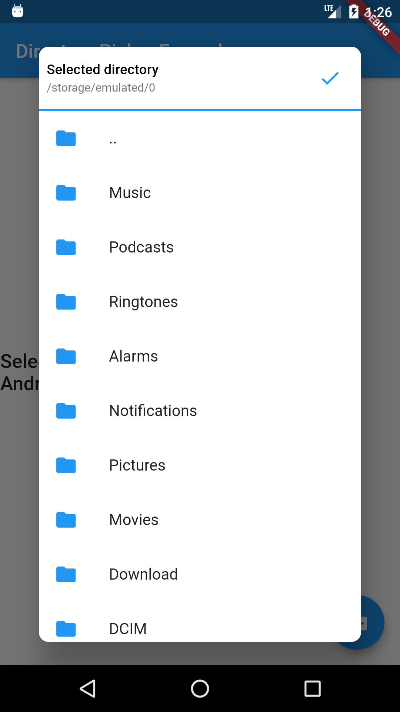

# Directory Picker

[](https://pub.dev/packages/directory_picker)

A flutter package to pick directories and handles requesting required permissions as well. This package only supports android.



## Installation  
  
Add below line to your `pubspec.yaml` and run `flutter packages get`  
```  
directory_pciker: ^0.0.1
```

## Permissions
Add below line to your `android/app/src/main/AndroidManifest.xml`
```
<uses-permission android:name="android.permission.READ_EXTERNAL_STORAGE" />
```

## Usage
```
import 'package:directory_picker/directory_picker.dart';
import 'package:path_provider/path_provider.dart';

// In any callback call the below method 
Directory newDirectory = await DirectoryPicker.pick(
  context: context,
  rootDirectory: directory
);

if (newDirectory != null) {
  // Do something with the picked directory
} else {
  // User cancelled without picking any directory
}
```

See [example](/example) app for more detailed usage.

## TODO
- [ ] Add support to create new folders directory from picker.
- [ ] Make `rootDirectory` optional.
- [ ] Better levels of customisation for picker dialog.